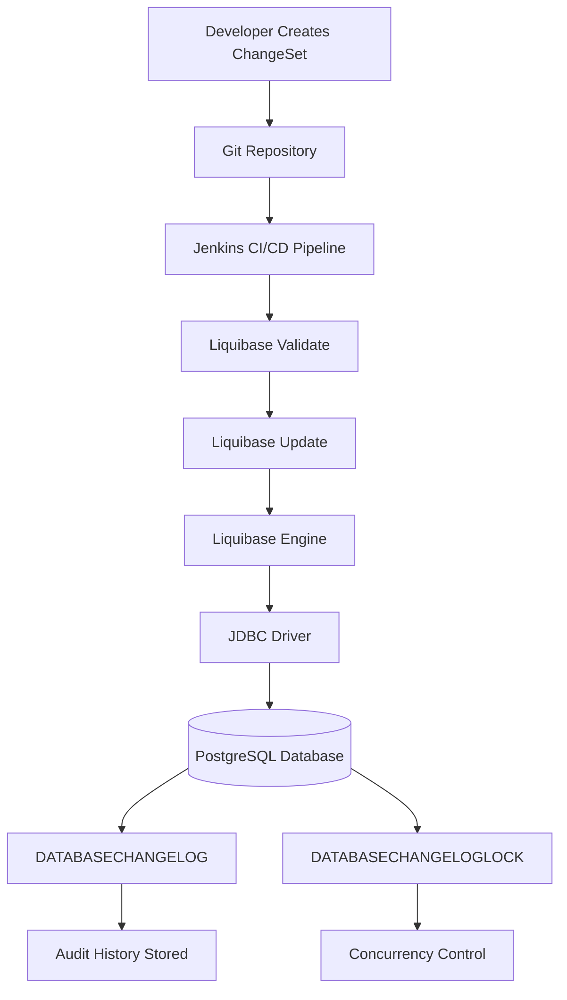
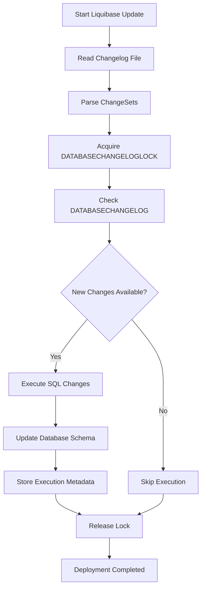
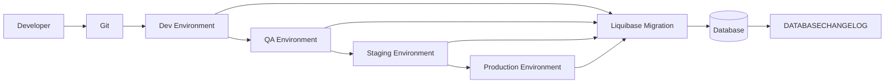
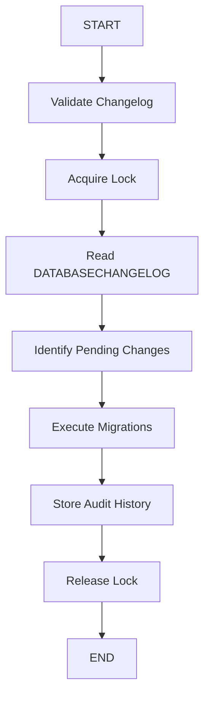
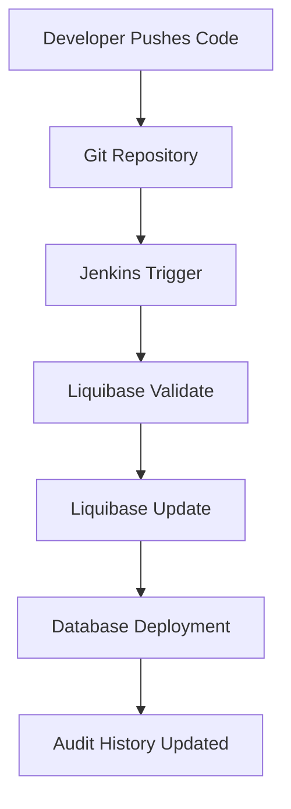
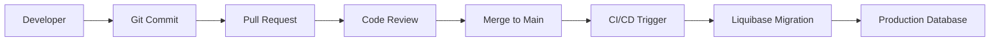
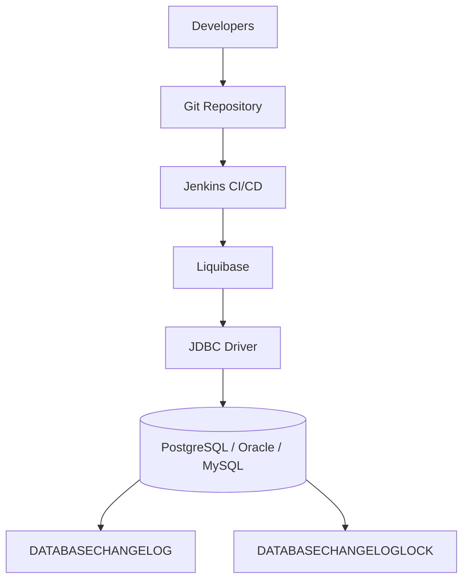
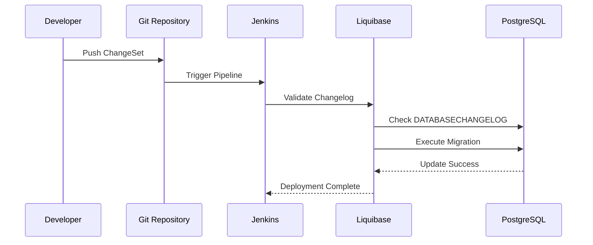

# Enterprise Documentation: Liquibase for Database DevOps & CI/CD


<details>
<summary><h1><strong>Table of Contents</strong></h1></summary>
1. [Introduction](#1-introduction)
2. [What is Liquibase?](#2-what-is-liquibase)
3. [Problems Before Liquibase](#3-problems-before-liquibase)
4. [Why Enterprises Need Liquibase](#4-why-enterprises-need-liquibase)
5. [Core Concepts of Liquibase](#5-core-concepts-of-liquibase)
6. [Liquibase Architecture](#6-liquibase-architecture)
7. [Liquibase Architecture](#7-liquibase-architecture)
8. [How Liquibase Works Internally](#8-how-liquibase-works-internally)
9. [Liquibase Execution Lifecycle](#9-liquibase-execution-lifecycle)
10. [Liquibase Components Explained](#10-liquibase-components-explained)
11. [Database Version Control](#11-database-version-control)
12. [Liquibase ChangeSets Deep Dive](#12-liquibase-changesets-deep-dive)
13. [Liquibase Changelog Types](#13-liquibase-changelog-types)
14. [Liquibase Commands](#14-liquibase-commands)
15. [Rollback Strategies](#15-rollback-strategies)
16. [Liquibase with Jenkins CI/CD](#16-liquibase-with-jenkins-cicd)
17. [Enterprise DevOps Workflow](#17-enterprise-devops-workflow)
18. [Liquibase Database Objects](#18-liquibase-database-objects)
19. [Liquibase Features](#19-liquibase-features)
20. [Liquibase Advantages](#20-liquibase-advantages)
21. [Liquibase Limitations](#21-liquibase-limitations)
22. [Liquibase vs Traditional DB Deployment](#22-liquibase-vs-traditional-db-deployment)
23. [Liquibase vs Flyway vs Atlas](#23-liquibase-vs-flyway-vs-atlas)
24. [Security & Governance](#24-security--governance)
25. [Best Practices for Enterprises](#25-best-practices-for-enterprises)
26. [Real Enterprise Use Cases](#26-real-enterprise-use-cases)
27. [Common Production Issues](#27-common-production-issues)
28. [Performance Considerations](#28-performance-considerations)
29. [Liquibase Enterprise Architecture Example](#29-liquibase-enterprise-architecture-example)
30. [Complete POC Explanation](#30-complete-poc-explanation)
31. [Final Understanding](#31-final-understanding)
</details>

# 1. Introduction

Modern enterprises deploy applications continuously using CI/CD pipelines, where application code is version-controlled through Git and released through automated workflows. However, databases were traditionally managed manually using SQL scripts, leading to major operational risks such as database drift, schema inconsistency, failed deployments, lack of rollback capability, poor auditability, and human errors in production environments.

This document provides an enterprise-level understanding of **Liquibase and its role in modern Database DevOps and CI/CD automation. It explains how Liquibase solves traditional database deployment challenges through schema version control, automated migrations, rollback management, audit tracking, governance, and CI/CD integration with tools like Jenkins.**

The document also covers **Liquibase architecture, internal workflow, enterprise best practices, production considerations, and detailed comparisons with Flyway and Atlas to help organizations choose the right database migration platform based on enterprise requirements.**

This guide is intended for:

* DevOps Engineers
* Database Administrators (DBAs)
* Platform Engineers
* Cloud Engineers
* Software Architects
* CI/CD Engineers
* Enterprise Infrastructure Teams

# 2. What is Liquibase?

Liquibase is an open-source database schema change management and version control tool.

Liquibase allows developers and DBAs to:

* Track database schema changes
* Automate deployments
* Maintain audit history
* Perform rollback operations
* Integrate databases into CI/CD pipelines
* Manage schema evolution safely

Liquibase treats database changes exactly like application source code.

# 3. Problems Before Liquibase

Before Liquibase, enterprises handled database deployments manually.


## 3.1 Manual SQL Deployments

DBAs manually executed scripts:

```sql id="6j1qg5"
ALTER TABLE users ADD COLUMN email VARCHAR(255);
```

Problems:

* Wrong execution order
* Missing scripts
* Human errors
* Difficult rollback
* No traceability

## 3.2 Environment Drift

Different environments became inconsistent.

| Environment | Schema Version |
| ----------- | -------------- |
| Dev         | v5             |
| QA          | v4             |
| Production  | v3             |

This caused:

* application failures
* incompatible releases
* deployment instability


## 3.3 No Audit Trail

Organizations could not answer:

* Who changed the DB?
* When was it changed?
* What was deployed?
* Which release caused failure?


## 3.4 No Rollback Capability

Production failures required:

* manual fixes
* emergency restores
* downtime

---

## 3.5 No CI/CD Integration

Application deployments were automated.

Database deployments were not.

This broke DevOps automation principles.


# 4. Why Enterprises Need Liquibase

Liquibase introduces the concept of:

# Database-as-Code

Database changes become:

* version-controlled
* repeatable
* auditable
* automated
* traceable


## Enterprise Problems Solved

| Enterprise Need  | Liquibase Solution     |
| ---------------- | ---------------------- |
| Auditability     | DATABASECHANGELOG      |
| Rollback         | rollback strategies    |
| CI/CD Automation | Jenkins/GitHub/GitLab  |
| Governance       | checksum validation    |
| Security         | controlled deployments |
| Consistency      | ordered migrations     |
| Compliance       | audit tracking         |


# 5. Core Concepts of Liquibase


## 5.1 Changelog

Main file containing database changes.

Example:

```xml id="e8q2xf"
<databaseChangeLog>
    <include file="001-init.xml"/>
</databaseChangeLog>
```

Purpose:

* migration registry
* execution controller

---

## 5.2 ChangeSet

Smallest executable database unit.

Example:

```xml id="i2evzi"
<changeSet id="1" author="dev">
    <createTable tableName="users"/>
</changeSet>
```

Each ChangeSet is:

* unique
* versioned
* tracked
* auditable


## 5.3 Rollback

Defines reverse operation.

Example:

```xml id="qaqm2x"
<rollback>
    <dropTable tableName="users"/>
</rollback>
```

## 5.4 DATABASECHANGELOG

Liquibase audit table storing:

* execution history
* timestamps
* checksums
* execution order

---

## 5.5 DATABASECHANGELOGLOCK

Locking mechanism preventing:

* parallel deployments
* race conditions
* corruption


# 6. Liquibase Architecture

## High-Level Architecture

```text id="m8qq7v"
Developer
   ↓
Git Repository
   ↓
CI/CD Pipeline
   ↓
Liquibase Engine
   ↓
JDBC Driver
   ↓
Database
   ↓
DATABASECHANGELOG
```

# 7. Liquibase Architecture

## Enterprise CI/CD Flow



---

## Liquibase Internal Execution Flow



---

## Enterprise Multi-Environment Deployment Flow



---

# 8. How Liquibase Works Internally

When executing:

```bash id="vf7z91"
liquibase update
```

Liquibase performs:

---

## Step 1 — Read Changelog

Reads:

```xml id="8bz6ws"
db.changelog-master.xml
```

---

## Step 2 — Parse ChangeSets

Builds migration execution plan.

---

## Step 3 — Connect to Database

Uses JDBC:

```text id="n8l6w0"
Liquibase → JDBC → PostgreSQL
```

---

## Step 4 — Check DATABASECHANGELOG

Checks executed migrations.

---

## Step 5 — Execute Pending Changes

Runs only new ChangeSets.

---

## Step 6 — Store Metadata

Stores:

* timestamps
* checksums
* execution order
* deployment status

---

# 9. Liquibase Execution Lifecycle



---

# 10. Liquibase Components Explained

| Component       | Purpose             |
| --------------- | ------------------- |
| Liquibase CLI   | Executes commands   |
| Changelog       | Defines migrations  |
| ChangeSet       | Single migration    |
| JDBC Driver     | DB communication    |
| Rollback Engine | Reverse deployment  |
| Audit Table     | Migration history   |
| Lock Table      | Prevent concurrency |

---

# 11. Database Version Control

Liquibase brings Git-like versioning to databases.

Without Liquibase:

```text id="z3v87x"
Unknown database state
```

With Liquibase:

```text id="2c7xnb"
v1 → v2 → v3 → v4
```

Every schema becomes reproducible.

---

# 12. Liquibase ChangeSets Deep Dive

## Structure

```xml id="q9w5ry"
<changeSet id="1" author="admin">
```

---

## Important Fields

| Field    | Meaning                     |
| -------- | --------------------------- |
| id       | unique migration identifier |
| author   | developer/DBA               |
| checksum | integrity validation        |

---

## Important Rule

Never modify executed ChangeSets in production.

Why?

Liquibase validates checksum integrity.

---

# 13. Liquibase Changelog Types

| Format | Supported |
| ------ | --------- |
| XML    | Yes       |
| YAML   | Yes       |
| JSON   | Yes       |
| SQL    | Yes       |

---

## SQL Example

```sql id="lh4l4v"
--liquibase formatted sql

--changeset admin:1
CREATE TABLE users (
 id BIGINT PRIMARY KEY
);
```

---

# 14. Liquibase Commands

## Validate

```bash id="y0y4n5"
liquibase validate
```

Checks:

* syntax
* references
* changelog integrity

---

## Update

```bash id="0xq6n2"
liquibase update
```

Applies migrations.

---

## Rollback

```bash id="5u2v49"
liquibase rollbackCount 1
```

Reverts changes.

---

## Status

```bash id="9o5vxq"
liquibase status
```

Shows pending changes.

---

## History

```bash id="1f5xkn"
liquibase history
```

Shows migration history.

---

# 15. Rollback Strategies

| Rollback Type | Purpose             |
| ------------- | ------------------- |
| rollbackCount | rollback N changes  |
| rollbackTag   | rollback to release |
| rollbackDate  | rollback by date    |

---

## Rollback Example

```xml id="d7q4lx"
<rollback>
   <dropColumn tableName="users" columnName="email"/>
</rollback>
```

---

# 16. Liquibase with Jenkins CI/CD

Jenkins integrates Liquibase into enterprise pipelines.

---

## CI/CD Flow



---

## Benefits

* automated deployments
* reduced human error
* rollback safety
* continuous delivery

---

# 17. Enterprise DevOps Workflow



---

# 18. Liquibase Database Objects

## DATABASECHANGELOG

Stores:

* executed changes
* timestamps
* checksums
* deployment sequence

---

## DATABASECHANGELOGLOCK

Prevents:

* parallel migration execution
* deployment corruption

---

# 19. Liquibase Features

| Feature             | Description                 |
| ------------------- | --------------------------- |
| Schema Versioning   | Tracks DB evolution         |
| Rollback Support    | Safe recovery               |
| Drift Detection     | Detect unauthorized changes |
| Multi-DB Support    | Oracle/Postgres/MySQL       |
| CI/CD Integration   | Jenkins/GitHub/GitLab       |
| Audit Tracking      | Full execution history      |
| Checksum Validation | Prevent tampering           |
| Contexts & Labels   | Environment targeting       |

---

# 20. Liquibase Advantages

| Advantage         | Explanation                   |
| ----------------- | ----------------------------- |
| Automation        | Eliminates manual deployments |
| Governance        | Enterprise compliance         |
| Rollback          | Faster recovery               |
| Auditability      | Full history tracking         |
| Consistency       | Same schema everywhere        |
| CI/CD Integration | DevOps ready                  |
| Collaboration     | Developers + DBAs             |

---

# 21. Liquibase Limitations

| Limitation            | Explanation                 |
| --------------------- | --------------------------- |
| Learning Curve        | XML/YAML complexity         |
| Complex Rollbacks     | Not always reversible       |
| Large Data Migration  | Performance concerns        |
| Merge Conflicts       | Parallel development issues |
| Vendor SQL Dependency | DB-specific behavior        |

---

# 22. Liquibase vs Traditional DB Deployment

| Traditional       | Liquibase               |
| ----------------- | ----------------------- |
| Manual scripts    | Automated migrations    |
| No rollback       | Rollback supported      |
| No audit          | Full audit history      |
| Environment drift | Consistent environments |
| DBA dependency    | Self-service automation |

---

# 23. Liquibase vs Flyway vs Atlas

## Detailed Comparison Table

| Feature              | Liquibase   | Flyway    | Atlas     |
| -------------------- | ----------- | --------- | --------- |
| Rollback Support     | Advanced    | Basic     | Moderate  |
| Audit Tracking       | Excellent   | Moderate  | Moderate  |
| Governance           | Strong      | Limited   | Moderate  |
| Drift Detection      | Excellent   | Limited   | Excellent |
| XML/YAML/JSON        | Yes         | Limited   | No        |
| SQL Support          | Excellent   | Excellent | Good      |
| CI/CD Integration    | Excellent   | Excellent | Good      |
| Compliance Support   | Excellent   | Weak      | Moderate  |
| Enterprise Readiness | Excellent   | Good      | Emerging  |
| Kubernetes/GitOps    | Moderate    | Limited   | Strong    |
| Learning Curve       | Medium-High | Easy      | Medium    |

---

## Enterprise Decision Matrix

| Scenario                    | Best Tool |
| --------------------------- | --------- |
| Banking Platform            | Liquibase |
| Healthcare System           | Liquibase |
| Startup MVP                 | Flyway    |
| GitOps/Kubernetes           | Atlas     |
| Regulated Enterprise        | Liquibase |
| Lightweight SQL Migration   | Flyway    |
| Cloud-Native Infrastructure | Atlas     |

---

## Why Liquibase is Best for Enterprises

Liquibase provides:

* governance
* rollback safety
* auditability
* compliance
* CI/CD integration
* multi-environment consistency
* schema lifecycle management

Liquibase is not just a migration tool.

It is a complete **Enterprise Database DevOps Platform**.

---

# 24. Security & Governance

## Enterprise Security Features

* least privilege access
* checksum validation
* immutable migration tracking
* audit logging

---

## Compliance Support

Liquibase supports:

* SOX
* PCI-DSS
* HIPAA
* enterprise audit requirements

---

# 25. Best Practices for Enterprises

## Recommended Practices

* one change per ChangeSet
* never edit executed ChangeSets
* always define rollback logic
* use Git branching
* separate environments
* secure DB credentials
* use Jenkins secrets/Vault

---

# 26. Real Enterprise Use Cases

| Industry   | Usage                        |
| ---------- | ---------------------------- |
| Banking    | regulated schema deployments |
| Telecom    | distributed DB upgrades      |
| Healthcare | audit-heavy environments     |
| SaaS       | continuous schema evolution  |
| E-Commerce | rapid feature releases       |

---

# 27. Common Production Issues

| Issue             | Cause              |
| ----------------- | ------------------ |
| Lock table stuck  | pipeline crash     |
| Checksum mismatch | modified ChangeSet |
| Rollback failure  | missing rollback   |
| Migration failure | invalid SQL        |

---

# 28. Performance Considerations

## Enterprise Challenges

* TB-scale tables
* online schema changes
* long-running migrations

---

## Best Practices

* phased deployments
* off-peak execution
* rollback testing
* avoid table rewrites

---

# 29. Liquibase Enterprise Architecture Example



---

# 30. Complete POC Explanation

Your POC demonstrates:

* Database version control
* Automated CI/CD deployment
* Rollback capability
* Audit history
* Concurrency protection
* DevOps integration

---

## POC Flow



---

# 31. Final Understanding

## Final Enterprise Definition

Liquibase is an enterprise-grade Database DevOps and schema version control platform that automates database change management through versioned migrations, CI/CD integration, rollback support, audit tracking, governance, and environment consistency.

---

# Final Enterprise Summary

Liquibase transforms databases from:

```text id="6fzg8v"
Manual, risky, DBA-driven deployments
```

into:

```text id="m7n0x9"
Automated, version-controlled, auditable DevOps assets
```

It enables enterprises to achieve:

* Continuous Delivery
* Database Governance
* Compliance
* Faster Releases
* Safer Deployments
* Reliable Rollbacks
* Infrastructure Automation
* Multi-Environment Consistency
